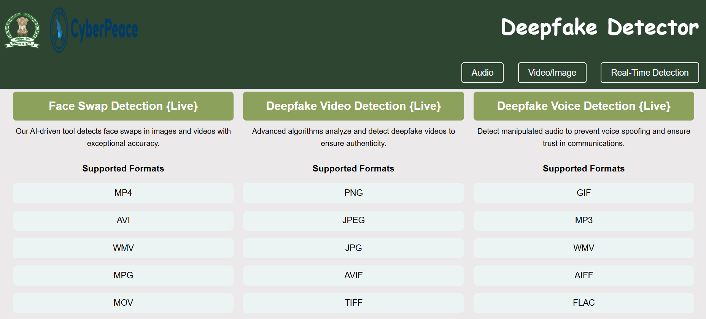
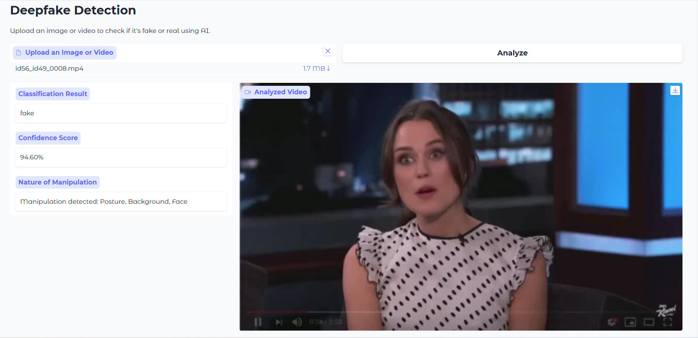

# Deepfake Detection Project

## Overview
This project leverages cutting-edge machine learning models and computer vision techniques to detect deepfake media, including images, videos, and audio. It aims to identify manipulated content and ensure the authenticity of digital data.


## Features
- **Image and Video Deepfake Detection**: Detects tampered visual content with high accuracy.  
- **Audio Deepfake Detection**: Identifies synthesized or manipulated audio files.  
- **User-Friendly Interface**: Web-based platform for seamless usage and interaction.  
- **Interactive Visualizations**: Presents results in an easy-to-interpret format.  

## Technology Stack
- **Programming Language**: Python  
- **Libraries Used**: OpenCV, PyTorch, Transformers, Gradio  
- **Frontend Technologies**: HTML, CSS, JavaScript  
- **Backend**: Flask/Django (if applicable)  

## How to Run

### Setup
1. Clone the repository:
   ```bash
   git clone https://github.com/your-username/deepfake-detection.git
   cd deepfake-detection
Create a virtual environment and activate it:

bash
Copy code
python -m venv myenv
source myenv/bin/activate  # On Windows: myenv\Scripts\activate
Install dependencies:

bash
Copy code
pip install -r requirements.txt
For Image and Video Detection
Run the script:

bash
Copy code
python Image_Video.py
For Audio Detection
Run the audio detection script:

bash
Copy code
python audio.py
Web Interface
Open index.html in your browser for an interactive UI.

Screenshots
Main Page


Audio Deepfake Detection


Video and Image Detection



Repository Structure
css
Copy code
.
├── images/
│   ├── Audio.png
│   ├── Main.png
│   ├── imagecopy.png
│   ├── ImageVideo.png
│   ├── CyberPeace-Logo-Ver...
├── audio.py
├── Image_Video.py
├── index.html
├── script.js
├── style.css
├── Readme.md
├── TEAM_MAVERICKS.pptx
├── territorial_army_logo...

Contributors
Aman Kumar

